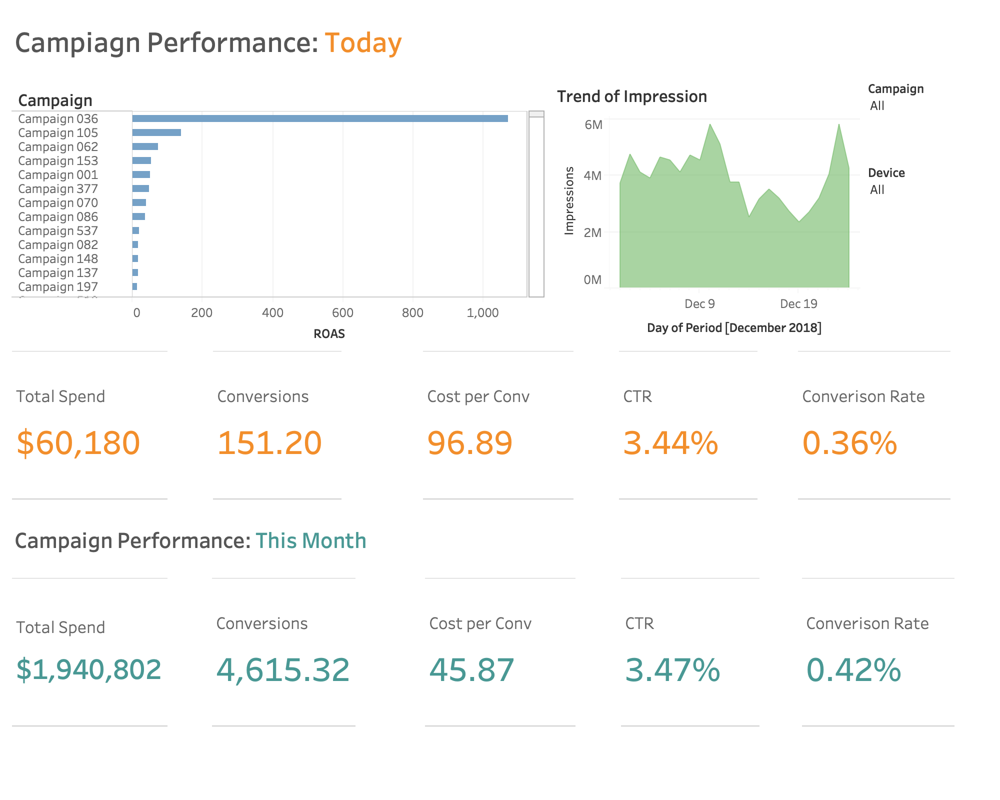

# Dashboard_Adwords

A dashboard is a collection of resources assembled to create a single unified visual display (source: https://bit.ly/2WLzInL), and I think that it's an important tool to help the digital marketers to maintain their campaigns on real-time / daily level. There is the dashboard I created to demonstrate important features when people maintain several cross-devices adwords campaigns. 

## Overview

Overview be presented inlined photo. To monitor adwords campaigns, you get to know which one you have to care at first. So,  the roas metric is really helpful to filter the campaigns with high paying back.  Besides, there are some metrics: impression, cost and conversion, to help you check wheteher your campaign performances well or not.   

Conversions is your goal. What you want to achieve in this campaign? Then, you have to detect the whole journey of  Conversions. First of all, Impression is for checking how many people see your ads. CTR to check proportion of people click your ads, then how many clicks trun into your conversions. Besides, you also need to monitor your cost, and set up the benchmark to campare ads performances with trend. In this dashboard, I used the monthly data as the benckmark. 

After you created useful metrics for you ads campaigns, I suggest that you can use the filter function in Tableau to synch devices and 

